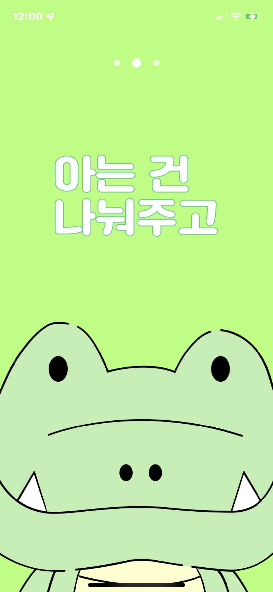
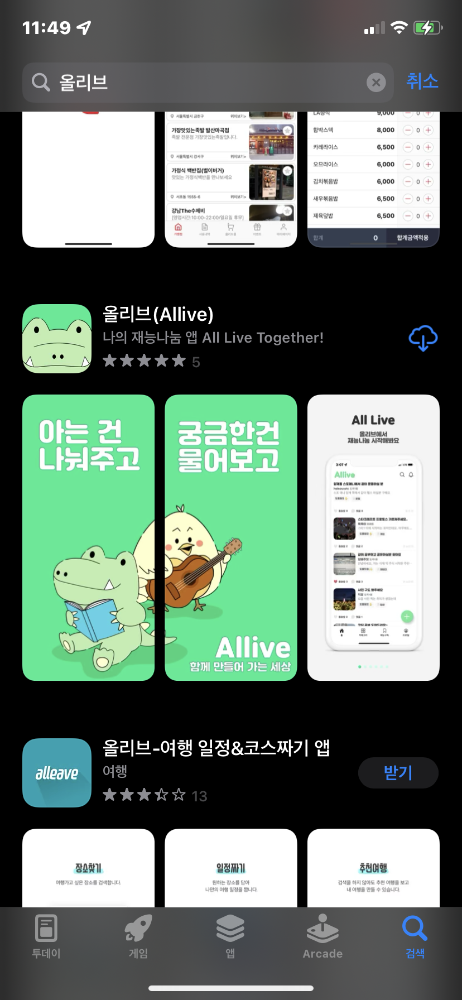
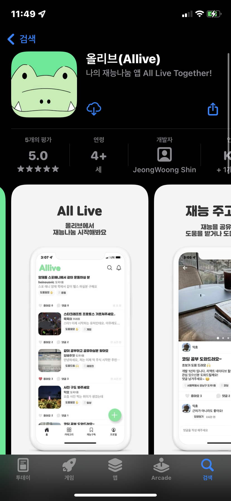
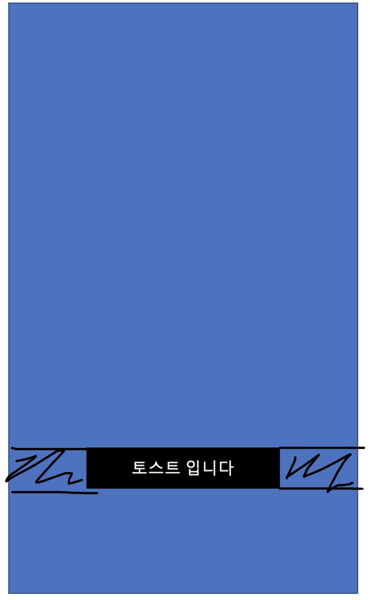
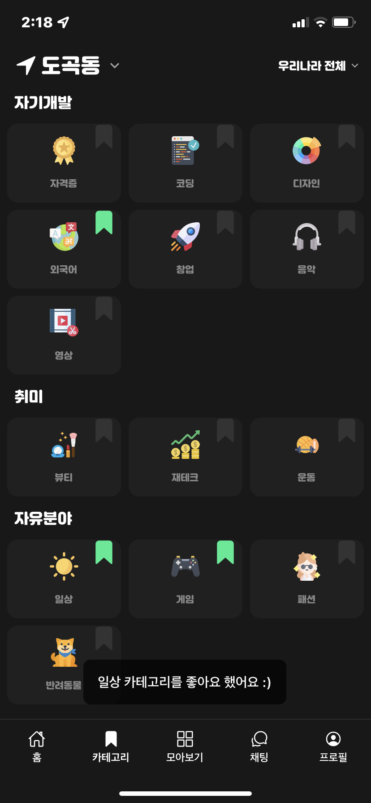

# Allive - 함께하는 세상 올리브

## Intro. 프로젝트 소개

올리브 프로젝트 소개 및 프론트 엔드 개발 회고 입니다 😁

프론트엔드 개발하면서 있었던 **크고 작은 고민에 대한 회고**를 남겨두기 위함 입니다 ✍️

#### 올리브는 어떤 프로젝트 인가요 🙋🏻

올리브 프로젝트 (**Allive**, **All Live Together**)는 2021년 3월부터 기획 및 기술 스택 스터디, 9월부터 본격적인 개발에 들어간 **재능나눔 어플** 프로젝트 입니다.

대학교 4학년 개발자 2명이서 학과 공부 및 회사 업무와 병행하며 퇴근 후, 주말 시간 등을 활용하여 열정을 불 태우며 개발중인 프로젝트 입니다. 🔥

<div class="center">
  
  
  
</div>

개발자 소개 입니다.

- 👨🏻‍💻 프론트 엔드 개발 - 신정웅 [github](https://github.com/JeongShin)

- 👨🏻‍💻 백엔드 개발 - 이신육 [github](https://github.com/leeshinyook)

#### 프론트엔드 App 기술스택

- React Native

- Styled Components Native

- Recoil js

- Firebase (Cloud Messaging, Crashlytics, Analytics)

#### 프론트엔드 Web 기술스택

- Next js

#### 백엔드 기술스택

- Java Spring

- AWS - elasticsearch

- Swagger

- TODO

#### 프로젝트 진행상황

|                     | iOS          | Android       | Web          |
| ------------------- | ------------ | ------------- | ------------ |
| 1차 배포 - 버전 1.0 | 배포 완료 ✅ | 심사진행중 💭 | 개발중 👷🏻    |
| 2차 배포 - 버전 1.1 | 2021.12 예정 | 2021.12 예정  | 2021.12 예정 |

2차 배포를 마무리로 프로젝트 마무리 될 예정 입니다.

## Note 1. Custom Event

RN 환경에서 개발을 하다가 `Custom Event` 를 발생시켜야 하는 상황이 생겼다.

인스타그램과 같은 앱에서 하단 탭을 여러번 탭하거나 로고를 누르는 경우 스크롤을 쭉 올려주는 구현을 하고 싶었다.

### 문제점

- 하단 탭 컴포넌트와 리스트 컴포넌트가 완전히 분리된 컴포넌트이기 때문에 소통할 수 있는 구조가 아니였다.
- Node Module **events** 를 사용해서 커스텀 이벤트를 발생시켜 구현하고 싶었지만 React Native 환경에서는 기본 모듈이 없다.
- 다른 라이브러리 찾아서 쓸까 고민 했지만 그냥 커스텀으로 만들어 보기로 결정했다.
- RN 코어 라이브러리를 제외하고는 다른 라이브러리 사용을 최소화하기 위한 노력이다.. ㅎㅎ

### 해결방안

일단 기본적인 `addEventListener` 와 클린업을 위한 `removeEventListener` 만 러프하게 작성해보았다.

```JS
type Callback = (args?: unknown) => Promise<void> | void;

class EventClass {
  private static Listeners = new Map<string, Callback>();

  static addEventListener(name: string, callback: Callback) {
    const [isNameString, isCallbackFn, isExists] = [
      typeof name === 'string',
      typeof callback === 'function',
      EventClass.Listeners.has(name),
    ];

    if (!isNameString || !isCallbackFn || isExists) return;

    EventClass.Listeners.set(name, callback);
  }

  static removeEventListener(name: string) {
    if (typeof name !== 'string') return;
    EventClass.Listeners.delete(name);
  }

  static emit(name: string, args?: unknown) {
    const callback = EventClass.Listeners.get(name);

    if (typeof callback === 'function') {
      callback(args);
    }
  }
}

export default EventClass;
```

이제 BottomTabs 에서 같은 탭을 두번 클릭하게 되는 경우 이벤트를 발생 시킨다.

```JS
import { Event } from '@all-live';

const BottomTabBar: React.FC<BottomTabBarProps> = ({ navigation, state }) => {
  const onTabPressHandler = useCallback(
    (currIdx: number, idx: number) => () => {
      if (currIdx !== idx) {
        navigation.navigate(state.routes[idx].name);
        return;
      }
      if (currIdx === BOTTOM_TABS.HOME_TAB_SCREEN) {
        // 두번 연속으로 같은 탭을 탭하는 경우 이벤트 발생
        Event.emit('scrollFlatListToTop');
      }
    },
    [],
  );
  // 생략
```

리스트 컴포넌트에선 이벤트 리스너를 등록해준다.

```JS
import { Event } from '@all-live';

const AllTalentList: FC<AllTalentListProps> = memo(({ navigation }) => {
  const flatListRef = useRef<FlatList>(null);

  const onScrollToTopHandler = useCallback(() => {
    flatListRef.current?.scrollToOffset({ animated: true, offset: 0 });
  }, []);

  useEffect(() => {
    // 이벤트 리스너 등록
    Event.addEventListener('scrollFlatListToTop', onScrollToTopHandler);
    return () => {
      // 클린업
      Event.removeEventListener('scrollFlatListToTop');
    };
  }, []);

  // 생략
```

동작이 잘되는걸 확인하고 나서 타입 적용을 시작했다.

목표는 아래와 같다.

1. 이벤트 이름 강제 시

2. 이벤트 이름에 따라 콜백에 인자가 있는 경우 인자 타입 정의

코드가 그렇게 길지 않아서 전체코드를 올리자면

```TS
// 여기 인터페이스를 기반으로 인자 타입을 결정 해준다.
interface CustomEvents {
  // 이벤트 이름: 인자 타입
  scrollFlatListToTop: undefined;
}

type Callback<T> = (args: T | Partial<T>) => Promise<void> | void;
type EventNames = Extract<keyof CustomEvents, string>;

class EventClass {
  private static Listeners = new Map();

  static addEventListener<EventName extends keyof CustomEvents = EventNames>(
    name: EventName,
    callback: Callback<CustomEvents[EventName]>,
  ) {
    const [isNameString, isCallbackFn, isExists] = [
      typeof name === 'string',
      typeof callback === 'function',
      EventClass.Listeners.has(name),
    ];

    if (!isNameString || !isCallbackFn || isExists) return;

    EventClass.Listeners.set(name, callback);
  }

  static removeEventListener(name: EventNames) {
    if (typeof name !== 'string') return false;
    return EventClass.Listeners.delete(name);
  }

  static removeAllEventListeners() {
    EventClass.Listeners.clear();
  }

  static emit<EventName extends keyof CustomEvents = EventNames>(name: EventName, args?: CustomEvents[EventName]) {
    const callback = EventClass.Listeners.get(name);

    if (typeof callback === 'function') {
      callback(args);
    }
  }
}

export default EventClass;
```

와 같이 해주었고 타입 적용이 잘 되고 있는지 확인 해보았다.

타입이 잘 적용 되는지 테스트 하기 위해 인터페이스를 아래와 같이 변경

```TS
interface CustomEvents {
  scrollFlatListToTop: { myParam: number };
}
```

**emit 하는 부분**

<div class="center">
  
</div>

**callback 등록하는 부분**

<div class="center">
  
</div>

잘된다 ㅎㅎ

### 결과

거의 뇌피셜로 구현해서 이렇게 하는게 맞는지 모르겠는데 기능은 대충 흉내낸거 같다.

<div class="center">
  
</div>

## Note 2. Toast 만들기

Toast Modal 을 커스텀하게 제작해서 사용하고 있는데 문제점이 있었다.

### 문제점 🚨

Toast Modal 이 떠있는 동안 화면을 제어하지 못한다.

문제가 발생한 이유는 `navigation` 을 이용해서 **transparent modal** 로 화면 이동을 해서 하는 방식으로 구현을 했는데 아래 요구사항을 쉽게 만족하기 위해서였다.

### 요구사항 💭

    ✅ Toast Modal 이 생겼다가 일정시간 이후 자동으로 사라져야함
    ✅ 애니매이션 (fade in, out) 효과가 있어야함
    ✅ 화면 뒤에 컨텐츠가 보여야 함
    ❌ 화면 제어가 가능해야함 → 문제 발생😱

4번 문제를 일단 냅두고 1차 배포를 했는데 이제 해결하기 위한 방법을 생각해보았다.

### 해결방안 🤔

기존 방식은 아래와 같이 navigation 을 통한 화면 이동이였다. 해당 방식으로는 애니메이션을 따로 코딩하지 않고 구현할 수 있어서 하였는데 4번 문제를 해결 할 수 없었다.

```JS
navigation.navigate('TOAST_MODAL', { body: TOAST_MESSAGES.TALENT.LIKED });
```

제일 처음 떠올린 해결방안은 navigation 을 통한 화면 이동이 아닌 작은 컴포넌트를 띄워주는 방식으로 해결 하고자 하였다.

부모 컴포넌트가 자식 컴포넌트를 제어해야하기 때문에 **`useImperativeHandle`** 을 활용 하였다.

전체 코드는 아래와 같다.

```tsx
type Timer = ReturnType<typeof setTimeout>;

const TOAST_TIMEOUT_IN_MS = 1200;

const Toast = forwardRef<ToastRef>((_, ref) => {
  const timer = useRef<Timer | null>(null);
  const isAnimating = useRef<boolean>(false);
  const { bottomInset } = useSafeArea();
  const animation = useRef(new Animated.Value(0)).current;

  const [body, setBody] = useState<string | null>(null);
  const [margin, setMargin] = useState<number>(0);

  const doneAnimatingCallback = useCallback(() => {
    isAnimating.current = false;
    setBody(null);
  }, []);

  const timeOutHandler = useCallback(() => {
    Animated.timing(animation, { toValue: 0, duration: 200, useNativeDriver: true }).start(
      doneAnimatingCallback
    );
  }, []);

  const onShowHandler = useCallback((toastProps: ToastProps) => {
    const { timeOutInMs = TOAST_TIMEOUT_IN_MS, body: toastBody } = toastProps;
    // 이미 다른 toast 가 animating 중인 경우 다른 toast 는 억제
    // 1. 큐에 넣어서 하나씩 처리할까 생각했지만 애매해서 중단
    // 2. 기존 toast 를 취소하고 새로운 toast 를 띄워주는 방식도 가능할듯
    if (isAnimating.current) return;
    isAnimating.current = true;
    setBody(toastBody);
    Animated.timing(animation, { toValue: 1, duration: 400, useNativeDriver: true }).start();
    timer.current = setTimeout(timeOutHandler, timeOutInMs);
  }, []);

  const imperativeHandler = useCallback(
    () => ({
      show: onShowHandler
    }),
    []
  );

  const onBodyLayoutHandler = useCallback((event: LayoutChangeEvent) => {
    // container left margin 을 계산하기 위함
    const containerWidth = event.nativeEvent.layout.width;
    if (typeof containerWidth !== 'number') return;
    setMargin(Math.floor((DIMENSIONS.WIDTH - containerWidth) / 2));
  }, []);

  useImperativeHandle(ref, imperativeHandler, []);

  return (
    <>
      {body && (
        <ToastStyle.Container
          as={Animated.View}
          leftMargin={margin}
          bottomInset={bottomInset}
          style={{ opacity: animation }}
        >
          <ToastStyle.BodyView onLayout={onBodyLayoutHandler}>
            <GlobalText.TextSmall color="whiteColor">{body}</GlobalText.TextSmall>
          </ToastStyle.BodyView>
        </ToastStyle.Container>
      )}
    </>
  );
});

const ToastStyle = {
  Container: Styled.View<SafeAreaInsets & { leftMargin: number }>`
    position: absolute;
    bottom: ${({ bottomInset = 0, theme }) => theme.bottomTabBarHeight + bottomInset + 16}px;
    margin-left: ${({ leftMargin }) => leftMargin}px;
  `,
  BodyView: Styled.View`
    border-radius: 8px;
    background-color: #000000aa;
    padding: 16px;
  `
};
```

각각 요구사항에 대한 구현은 아래와 같이 진행함!

1. Toast Modal 이 생겼다가 일정시간 이후 자동으로 사라져야함

   `imperativeHandler` 를 통해 부모 컴포넌트에서 **onShowHandler** 를 호출할 수 있도록 세팅,

   **setBody** 를 통해 뷰가 나타나도록 하고 **Animated API** 를 통해 opacity 애니메이션으로 fade in 효과 구현

   animation 은 useNativeDriver 를 통해 네이티브로 넘김

   setTimeOut 을 통해 fade out animation 호출 후 콜백으로 다음 애니메이션 가능하도록 isAnimating 값 업데이트

2. 애니매이션 (fade in, out) 효과가 있어야함

   위에 설명한 **Animated API** 로 해결!

3. 화면 뒤에 컨텐츠가 보여야 함

   ```jsx
   const CategoryTabScreen: React.FC<CategoryTabScreenProps> = ({ navigation }) => {
     // toast 제어하기 위한 ref
     const toastRef = useRef < ToastRef > null;

     const likePressHandler = useCallback(
       (subCategoryLikeInfo: SubCategoryLikeInfo) => async () => {
         try {
           // 생략
           // show handler 호출
           toastRef.current?.show({
             body: getCategoryLikeToastBody(subCategoryLikeInfo, result)
           });
         } catch (error) {
           // 생략
         }
       },
       []
     );

     return (
       <SafeAreaView>
         <OtherComponents likePressHandler={likePressHandler} />
         {/* SafeAreaView 에서 가장 앞쪽에 노출 되도록 */}
         <Toast ref={toastRef} />
       </SafeAreaView>
     );
   };
   ```

4. 화면 제어가 가능해야함 👉 핵심 이슈!

Container 컴포넌트를 width: 100% 로 Text 컴포넌트를 margin: 0 auto 와 같이 해줄 수 있지만 아래 그림과 같은 영역 터치가 불가능 해진다.

<div class="center">
  
</div>

따라서 container width 는 토스트 가로 길이에 딱 맞도록 하고 margin-left 속성을 동적으로 조절 해주는 방향으로 진행했다. 토스트를 제외한 모든 영역 터치가 가능하게 하도록 하기 위함이다.

`onBodyLayoutHandler` 를 통해 body 에 따른 뷰의 가로 길이를 계산해서 container margin-left 값을 동적으로 조절.

<div class="center">
  
</div>

잘 적용된 모습. 끝~!

~~개발자 입장에선 많은 변화가 있었지만 사용자들은 해당 이슈가 있는지도 모를때가 많다..ㅎㅎ~~

그래도 나만 만족하면 됨

<style>
.center {
  width: 100%;
  display: flex;
  justify-content: space-evenly;
  flex-direction: row;
  flex-wrap: wrap;
}
</style>
