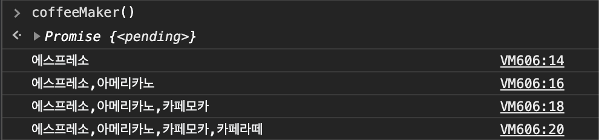

# Vanilla JavaScript II

## Step 7

자바스크립트는 기본적으로 Single Threaded 이다. 따라서 동시에 두가지 일을 하지는 못한다.

```JS
function delayBySeconds(sec) {
  let start = now = Date.now()
  while (now - start < (sec * 1000)) {
    now = Date.now();
  }
}
delayBySeconds(5)
```

위와 같은 코드를 실행하면 자바스크립트의 메인 쓰레드는 5초간 다른 작업을 수행하지 못한다. 즉 blocking 되어 있는 상태이다.

따라서 시간이 오래 걸리거나 어떤 응답을 기다리는 함수 등은 비동기적으로 처리해야한다.

콜백 함수에 대해 알아보기 전에 먼저 자바스크립트 메모리 구조에 대해 알아보자.

```JS
function LevelTwo () {
  console.log('Inside Level Two ! ');
}
function LevelOne () {
  LevelTwo();
}
function main() {
  LevelOne();
}
main();
```

다음과 같이 함수를 실행할 때 자바스크립트 call stack 은 아래와 같이 된다.

|   Tables    |
| :---------: |
| console.log |
|  LevelTwo   |
|  LevelOne   |
|    main     |

#### Web APIs

Web API 는 DOM, Ajax(네트워크 리퀘스트), setTimeout() 등의 main thread 에서는 수행하기 어려운 작업들을 수행을 돕는 API 이다. Web API를 통하여 mutiple thread 로 작업이 가능하다.

### JS Event Loop

```JS
setTimeout(func, 5000);
```

위의 함수가 실행되면 Web APIs 로 해당 함수 작업을 한다. 그러다 5초가 지나면 Event Queue 에 func가 push 되고 Stack 에 모든 함수가 종료되면 Event Queue 에서 func 함수를 가져와 수행한다.


console.log 함수가 실행되고 난 뒤 위에서부터 하나씩 스택에서 종료되며 없어진다.

### 동기 vs 비동기 프로그래밍

`동기적인 코드`는 현재 실행 중인 코드가 완료된 후 다음 코드를 실행하는 일반적인 방식이다. 동기적 코드는 CPU 계산에 의해 즉시 처리가 가능하다.

`비동기적인 코드`는 현재 실행 중인 코드의 완료 여부와 무관하게 즉시 다음 코드로 넘어간다. 이는 사용자 요청에 의해 특정 시간을 대기하거나 (setTimeout), 사용자의 직접적인 개입이 있을때 함수를 실행하도록 대기하거나(addEvenListener), 웹 브라우저가 아닌 별도 대상에 요청하는(XMLHttpRequest) **별도의 요청, 실행 대기, 보류** 등과 관련된 코드이다.

웹에서 비동기적인 코드의 비중이 높아진 만큼 콜백 지옥에 빠지지 않기위해 다음과 같은 방식의 코딩이 도입 되었다.

#### ES6 Promise, Generator

ES6에 등장한 Promise 를 이용한 방식은 new 연산자와 함께 호출한 Promise 의 인자로 넘겨주는 콜백 함수는 호출할 때 바로 실행되지만 **그 내부에 resolve 또는 reject 함수를 호출하는 구문이 있을 경우 둘 중 하나가 실행되기 전까지는 then 또는 catch 구문으로 넘어가지 않는다**.

따라서 비동기 작업이 완료될 때 비로소 resolve 또는 reject 를 호출 하는 방법으로 비동기적인 작업을 할 수 있다.

0.5 초마다 커피 목록을 수집하고 출력하는 코드를 Promise를 이용하여 다음과 같이 코딩할 수 있다.

```JS
const addCoffee = function (name) {
  return function (prevName) {
    return new Promise(function (resolve) {
      setTimeout (function() {
        var newName = prevName ? (prevName + ',' + name) : name;
        console.log(newName);
        resolve(newName);
      }, 500);
    });
  };
};
```

수행 결과


#### ES7 async, await

ES7 부터 추가된 새로운 기능인 async, await 는 비동기 작업을 수행하고자 하는 함수 앞에 async 를 표기하고 함수 내부에서 실질적인 비동기 작업이 필요한 위치마다 await 를 표기하는 것만으로 뒤의 내용을 Promise 로 자동 전환하고, 해당 내용이 resolve 된 이후 진행 된다.

```JS
var addCoffee = function (name) {
  return new Promise(function (resolve){
    setTimeout (function () {
      resolve(name);
    }, 500);
  });
};
var coffeeMaker = async function () {
  var coffeeList = '';
  var _addCoffee = async function (name) {
    coffeeList += (coffeeList ? ',' : '') + await addCoffee(name);
  };
  await _addCoffee('에스프레소');
  console.log(coffeeList);
  await _addCoffee('아메리카노');
  console.log(coffeeList);
  await _addCoffee('카페모카');
  console.log(coffeeList);
  await _addCoffee('카페라떼');
  console.log(coffeeList);
};
```

수행 결과


## Step 8 👉 Error Handling

출처 : [YouTube : Program With Erik](https://www.youtube.com/watch?v=LrGvvvmRkCE&ab_channel=ProgramWithErik)

### Example 1. Promise Catch

Promise 에서는 에러 핸들링을 다음과 같이 할 수 있다.

```js
// 1초 뒤에 resolve 되는 promise 를 아래와 같이 생성

const myPromise = new Promise((resolve, reject) => {
  setTimeout(() => resolve('resolved!'), 1000);
});

myPromise.then(val => console.log(val));

// Output : resolved!

// 하지만 만약 여기서 reject 가 된다면

const myPromise2 = new Promise((resolve, reject) => [setTimeout(() => reject('rejected'), 1000)]);

myPromise2.then(val => console.log(val));
// Error : Uncaught (in promise) rejected
myPromise2.then(val => console.log(val)).catch(err => console.log('err 👉', err));
// Output : err 👉 rejected
```

### Example 2. Async / await with try - catch

Promise 를 사용하더라도 nested.then 이 반복되면 가독성이 떨어질 수 있다.
Async / await 를 활용할 수 있는데 이 경우 예외처리를 어떻게 하는지 보자.

```js
/*
 * 예제 1. Promise 가 resolve 되는 경우
 */
const myPromise = new Promise((resolve, reject) => {
  setTimeout(() => resolve('resolved!'), 1000);
});
const testPromise = async () => {
  const data = await myPromise;
  console.log(data);
};

testPromise();
// output : resolved!

/*
 * 예제 2. Promise 가 reject 되는 경우
 */
const myPromise = new Promise((resolve, reject) => {
  setTimeout(() => reject('ERROR 🤯'), 1000);
});

const testPromise = async () => {
  try {
    const data = await myPromise;
  } catch (err) {
    console.error(err);
  }
  console.log(data);
};
// output : 'ERROR 🤯'
```

### Example 3. Async / await with Error Handler Factory

JS 의 일급함수의 특징을 이용하여 다음과 같이 에러 핸들링 할 수 있다.

```js
const myPromise = new Promise((resolve, reject) => {
  setTimeout(() => reject('ERROR 🤯'), 1000);
});

const testPromise = async () => {
  const data = await myPromise;
};

// errorHandler 는 함수를 인자로 받아온다.
const errorHandler = function(fn) {
  return function(...params) {
    // error 를 catch 하여 반환한다.
    return fn(...params).catch(function(err) {
      console.log(err);
    });
  };
};

// ES6 로 간결하게 표현하면
const errorHandler2 = fn => (...params) => fn(...params).catch(err => console.warn('ERROR', err));

errorHandler(testPromise)();
```

### Example 4. Custom Decorator

Decorator 디자인 패턴은 래퍼 wrapper pattern 이라고도 불리는데, 객체의 타입과 호출 가능한 메소드를 그대로 유지하면서 객체에 새로운 책임을 추가할 때 사용한다.

```javascript
import Catch from './decorator';
const myPromise = new Promise((resolve, reject) => {
  setTimeout(() => reject('ERROR 🤯'), 1000);
});

class myClass {
  @Catch
  async myFunc() {
    const test = await myPromise;
    console.log(test);
  }
}

const testClass = new myClass();
testClass.myFunc();
```

와 같이 myClass 라는 래퍼를 정의해주고 decorator.js 는 다음과 같이

```js
function Catch(target, key, descriptor) {
  const originalMethod = descriptor.value;
  descriptor.value = async function(...args) {
    try {
      return await originalMethod.apply(this, args);
    } catch (err) {
      console.error(err);
    }
  };
  // 함수를 반환 해준다.
  return descriptor;
}
export default Catch;
```

이와 같이 데코레이더 패턴을 이용해서 에러핸들링을 구현할 수 있다.
