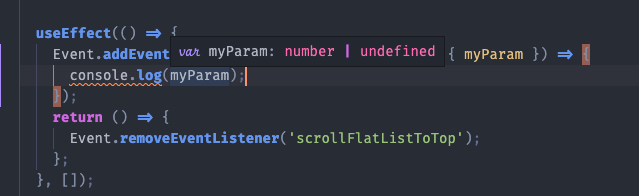

# 올리브 개발 일지

## Custom Event

RN 환경에서 개발을 하다가 `Custom Event` 를 발생시켜야 하는 상황이 생겼다. 

인스타그램과 같은 앱에서 하단 탭을 여러번 탭하거나 로고를 누르는 경우 스크롤을 쭉 올려주는 구현을 하고 싶었다. 

### 문제점

* 하단 탭 컴포넌트와 리스트 컴포넌트가 완전히 분리된 컴포넌트이기 때문에 소통할 수 있는 구조가 아니였다. 
* Node Module `events` 를 사용해서 커스텀 이벤트를 발생시켜 구현하고 싶었지만 React Native 환경에서는 기본 모듈이 없다. 
* 다른 라이브러리 찾아서 쓸까 고민 했지만 그냥 커스텀으로 만들어 보기로 결정했다. 
* RN 코어 라이브러리를 제외하고는 다른 라이브러리 사용을 최소화하기 위한 노력이다.. ㅎㅎ

### 해결방안

일단 기본적인 `addEventListener` 와 클린업을 위한 `removeEventListener` 만 러프하게 작성해보았다. 

```JS
type Callback = (args?: unknown) => Promise<void> | void;

class EventClass {
  private static Listeners = new Map<string, Callback>();

  static addEventListener(name: string, callback: Callback) {
    const [isNameString, isCallbackFn, isExists] = [
      typeof name === 'string',
      typeof callback === 'function',
      EventClass.Listeners.has(name),
    ];

    if (!isNameString || !isCallbackFn || isExists) return;

    EventClass.Listeners.set(name, callback);
  }

  static removeEventListener(name: string) {
    if (typeof name !== 'string') return;
    EventClass.Listeners.delete(name);
  }

  static emit(name: string, args?: unknown) {
    const callback = EventClass.Listeners.get(name);

    if (typeof callback === 'function') {
      callback(args);
    }
  }
}

export default EventClass;
```

이제 BottomTabs 에서 같은 탭을 두번 클릭하게 되는 경우 이벤트를 발생 시킨다. 

```JS
import { Event } from '@all-live';

const BottomTabBar: React.FC<BottomTabBarProps> = ({ navigation, state }) => {
  const onTabPressHandler = useCallback(
    (currIdx: number, idx: number) => () => {
      if (currIdx !== idx) {
        navigation.navigate(state.routes[idx].name);
        return;
      }
      if (currIdx === BOTTOM_TABS.HOME_TAB_SCREEN) {
        // 두번 연속으로 같은 탭을 탭하는 경우 이벤트 발생
        Event.emit('scrollFlatListToTop');
      }
    },
    [],
  );
  // 생략
```

리스트 컴포넌트에선 이벤트 리스너를 등록해준다. 

```JS
import { Event } from '@all-live';

const AllTalentList: FC<AllTalentListProps> = memo(({ navigation }) => {
  const flatListRef = useRef<FlatList>(null);

  const onScrollToTopHandler = useCallback(() => {
    flatListRef.current?.scrollToOffset({ animated: true, offset: 0 });
  }, []);

  useEffect(() => {
    // 이벤트 리스너 등록
    Event.addEventListener('scrollFlatListToTop', onScrollToTopHandler);
    return () => {
      // 클린업
      Event.removeEventListener('scrollFlatListToTop');
    };
  }, []);

  // 생략
```

동작이 잘되는걸 확인하고 나서 타입 적용을 시작했다. 

목표는 아래와 같다. 

1. 이벤트 이름 강제 시

2. 이벤트 이름에 따라 콜백에 인자가 있는 경우 인자 타입 정의

코드가 그렇게 길지 않아서 전체코드를 올리자면

```TS
// 여기 인터페이스를 기반으로 인자 타입을 결정 해준다. 
interface CustomEvents {
  // 이벤트 이름: 인자 타입
  scrollFlatListToTop: undefined;
}

type Callback<T> = (args: T | Partial<T>) => Promise<void> | void;
type EventNames = Extract<keyof CustomEvents, string>;

class EventClass {
  private static Listeners = new Map();

  static addEventListener<EventName extends keyof CustomEvents = EventNames>(
    name: EventName,
    callback: Callback<CustomEvents[EventName]>,
  ) {
    const [isNameString, isCallbackFn, isExists] = [
      typeof name === 'string',
      typeof callback === 'function',
      EventClass.Listeners.has(name),
    ];

    if (!isNameString || !isCallbackFn || isExists) return;

    EventClass.Listeners.set(name, callback);
  }

  static removeEventListener(name: EventNames) {
    if (typeof name !== 'string') return false;
    return EventClass.Listeners.delete(name);
  }

  static removeAllEventListeners() {
    EventClass.Listeners.clear();
  }

  static emit<EventName extends keyof CustomEvents = EventNames>(name: EventName, args?: CustomEvents[EventName]) {
    const callback = EventClass.Listeners.get(name);

    if (typeof callback === 'function') {
      callback(args);
    }
  }
}

export default EventClass;
```


와 같이 해주었고 타입 적용이 잘 되고 있는지 확인 해보았다. 

타입이 잘 적용 되는지 테스트 하기 위해 인터페이스를 아래와 같이 변경 

```TS
interface CustomEvents {
  scrollFlatListToTop: { myParam: number };
}
```

emit 하는 부분

<div class="center">
  
</div>

callback 등록하는 부분

<div class="center">
  
</div>

잘된다 ㅎㅎ

### 결과

거의 뇌피셜로 구현해서 이렇게 하는게 맞는지 모르겠는데 기능은 대충 흉내낸거 같다. 

<div class="center">
  
</div>


<style>
.center {
  width: 100%;
  display: flex;
  justify-content: center;
  flex-direction: row;
}
</style>
