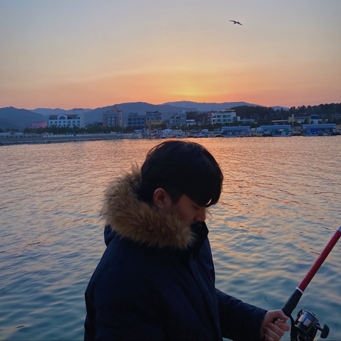

<h1 style = "font-family: 'Josefin Sans', sans-serif; text-shadow: 3px 3px 20px #000;"> Jeong Shin </h1>

    💁🏻‍♂️ 신정웅
    💖 웹, 프론트 엔드
    🏫 학력
        🇺🇸 몽고메리 아카데미 졸업
        🇰🇷 단국대학교 소프트웨어 학과 16학번 재학중

