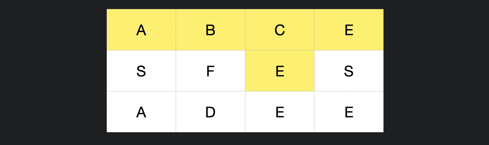
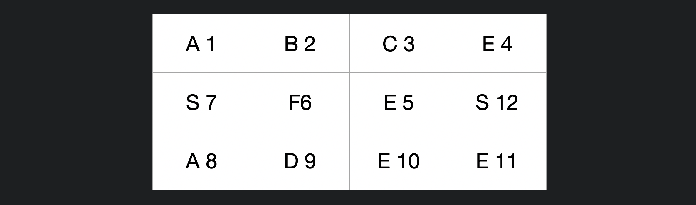
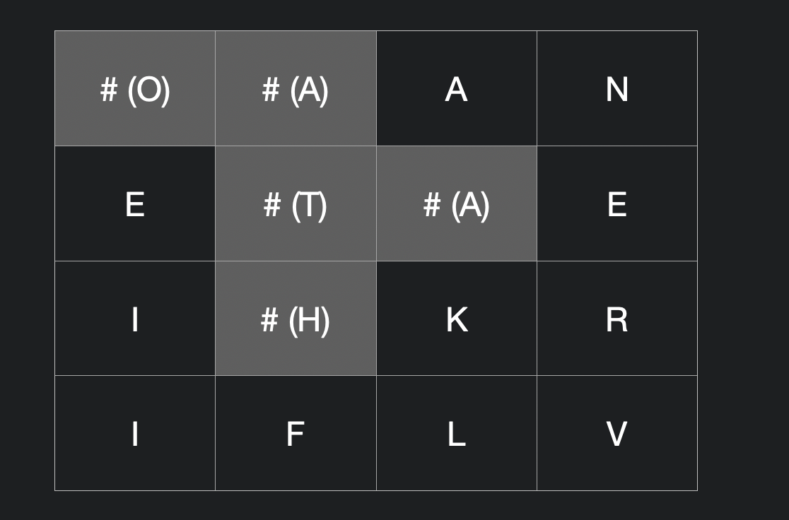

# 릿 코드

## Word Search 👉 DFS ,Backtracking

[문제 링크](https://leetcode.com/problems/word-search/) [나의풀이](https://github.com/DKU-STUDY/Algorithm/blob/master/LeetCode/Backtracking/Word_Search/JeongShin.js)

### 문제 정의

Board 에 알파벳이 다음과 같이 주어질 때, 단어를 찾는다.

이때 출발 단어로 부터 상, 하, 좌, 우 방문하지 않은 단어들을 찾아간다.

```JS
board =
[
  ['A','B','C','E'],
  ['S','F','C','S'],
  ['A','D','E','E']
]
"ABCCED" 👉 true
"SEE" 👉 true
"ABCB" 👉 false
```

를 반환해야 한다.

### 풀이 & 코드

처음에 이 문제를 일반적인 DFS 알고리즘 문제라 얕보았다 ~~나의 오만한 판단이였음을 깨달았지만~~.

나를 힘들게 했던 다음과 같은 테스트 케이스를 고려해보자.

    board = [["A","B","C","E"],["S","F","E","S"],["A","D","E","E"]]
    word = "ABCEFSADEESE"

탐색은 아래와 같이 진행 될 수 있다.



이때 A 👉 B 👉C 👉 E 로 탐색을 하다 C 로 되돌아 간다. 이를 방문 순서대로 매겨보면



다음과 같이 12 번 까지 탐색을 하는데 마지막에 이미 4번을 방문하여 탐색을 완료하지 못한다.

따라서, **탐색을 실패하면 방문했던 단어들의 정보를 다시 false** 로 바꿔야 한다.

슈도코드는 다음과 같다.

```JS
function search ( i , j , index ):
    if index is word.length
        return true

    if
    i, j is outofbound or
    word[index] is not board[i][j] or
    visited [i,j] already :
        return false

    update visited [i, j] true

    // dfs 탐색을 성공할 경우
    if search (up) || search (down) || search (left) || search (right):
        return true
    // dfs 탐색을 실패할 경우
    else:
        update visited [i, j] false
        return false
```

### 어려웠던 점

dfs 탐색 도중 탐색 실패한 좌표들을 false로 다시 수정해주는게 상당히 까다롭게 느껴졌음.

Backtracking 을 구현할 때 recursive function 에서 논리적인 순서에 맞게 구현하고 적절하게 return 해주는 시점 중요하다는걸 느꼇음.

Recursive, Backtracking 등의 문제는 많은 연습을 통해 경험을 쌓아야겠다.

## Word Search II 👉 DFS, Trie

[문제 링크](https://leetcode.com/problems/word-search-ii/) [나의 풀이](https://github.com/DKU-STUDY/Algorithm/blob/master/LeetCode/Backtracking/Word_Search_II/JeongShin.js)

### 문제 정의

이 문제는 위의 Word Search I 과 이어지는 문제이다.

아래와 같이 board 로 알파벳들과 words 단어가 주어질 때, board 에서 만들어 질 수 있는 모든 단어를 (위의 문제 규칙과 동일) 찾는 문제.

```JS
const findWords = function (board, words)
{ /* 풀이 */};

board = [
    ['o', 'a', 'a', 'n'],
    ['e', 't', 'a', 'e'],
    ['i', 'h', 'k', 'r'],
    ['i', 'f', 'l', 'v']
];
words = ["oath", "pea", "eat", "rain", "oata"]);

findWords(board, words)
```

["eat", "oath", "oata"] 를 반환 해야 한다.

### 풀이 & 코드

이 문제는 dfs 알고리즘과 trie 자료구조를 이용하여 풀이 하였다.

만약 trie 를 사용하지 않고 linear search 로 words 내에 단어를 순회한다 생각하면 시간복잡도는 정말 생각만해도 끔찍하다🤯🤢🤮.

먼저 아래와 같이 단어 배열들의 정보로 trie 를 구현 해준다.


아이디어는 Board 의 모든 값을 하나씩 순회하면서 root 에서 해당 단어가 있을 경우 find 함수를 수행한다.

내가 구현한 find 함수는 다음과 같다.

```JS
find(board, i, j, answer, node = this.root) {
/* 1. 현재 i, j 가 Board 에 유효한지 범위를 검사한다.
 if 유효하지 않을 경우 탐색 종료 */
    if (this.checkOutOfBound(i, j))
        return false;

/* 2. 해당 board 에 문자를 가져온 뒤 char 에 저장 한다.
Trie 에서 현재 노드가 해당 char 을 가지고 있는 자식을 찾는다.
if 문자가 '#' 이거나 자식이 없는 경우 탐색 종료 */
    const char = board[i][j];
    const child = node.children.get(char);
    if (char === '#' || !child)
        return;

/* if 현재 노드가 isEnd 가 true, 즉, 단어를 찾았을 경우 answer 배열에 추가
(이때 isEnd 값이 단어 자체로 구현할 경우,
trie 에서 따로 방문한 모든 노드의 key 값을 더 해가면서 word를 구할 필요가 없다). */
    if (child.isEnd)
        answer.add(child.isEnd);

/* 현재 board 의 위치를 방문 함으로 설정해주고 ('#' 사용)
상, 하, 좌, 우 탐색 진행 */
    board[i][j] = '#';
    this.find(board, i - 1, j, answer, child);
    this.find(board, i + 1, j, answer, child);
    this.find(board, i, j + 1, answer, child);
    this.find(board, i, j - 1, answer, child);

/* 현재 위치에 원래 있던 값 삽입 */
    board[i][j] = char;
}
```

1번 문제와 차이점은 1번 문제의 경우 하나의 단어만 찾으면 되기 때문에 if 문에서 or 로 find 를 묶어준다. 따라서 하나의 dfs 탐색만 성공하면 true로 전체 알고리즘이 종료된다.

반면 이번 문제의 경우 하나를 찾아도 계속 탐색을 이어가야 한다.



따라서 다음과 같이 탐색을 구현하였다. 'O' 에 해당하는 Trie 에 단어들을 탐색하는데 O에서 시작하면 거쳐간 모든 단어들을 #으로 바꾸어 visited 를 체크하고 탐색을 이어 나간다.

'O'로 시작하는 모든 탐색이 종료되면 다시 원래 제 자리에 있던 char 값을 다시 넣어준다.

### 어려웠던 점

방문 정보를 관리하는게 어려웠음. 이때 '#' 문자를 사용하는 걸 다른 사람의 코드를 보고 아이디어를 얻었는데 이는 backtracking 을 제대로 이해해야만 구현할 수 있는 코드임.

꼭 복습해보자. 어렵다 ㅠ ㅠ.

## Edit Distance 👉 DP, Levenshtein Distance

[문제 링크](https://leetcode.com/problems/edit-distance/) [나의 풀이](https://github.com/DKU-STUDY/Algorithm/blob/master/LeetCode/Dynamic_Programming/Edit_Distance/JeongShin.js)

### 문제 정의

문자열을 word1 👉 word2 로 편집한다. 이때 각각

1. Update 비용
2. Insertion 비용
3. Deletion 비용

이 발생할 때, 최소 비용으로 편집할 때 비용을 구하는 문제

### 풀이 & 코드

이 문제는 전통적인 dp 문제중 하나이다.

DP 표를 작성하기 전에 상관관계를 파악할 필요가 있다.

"HOR" 👉 "HO" 로 바꾸는 경우를 고려할 때 우리는 오로지 "R" 만 신경 쓰면 된다.

즉, 이미 같은 문자열은 고려할 필요가 없다.

따라서, "HORSE" 를 "ROS" 로 바꾼다 가정하면, 아래와 같이 sub-problems 로 나누어 해를 구할 수 있다.


위의 표에서 색칠된 부분은 "HOR" 에서 "R" 로 바꾸는 최소 비용을 구하는 sub-problem 에 해당된다. 이는 이전 sub-problems 에서

    | 변경 | 삭제 |
    | 삽입 | 현재 |

#### Problem : 현재 편집 비용 C 구하기

구하고자 하는 편집 비용 : C ("HOR" 👉 "R")

1. 변경해서 현재 단어로 오는 경우 + (현재 고려중인 문자가 다를 경우) 1 / 0

C ("HO" 👉 "") + 0 (현재 고려중인 "R" 은 동일하기 때문)

2. 삭제 해서 현재 단어로 오는 경우 + 1

C ("HOR" 👉 "")

3. 삽입 하여 현재 단어로 오는 경우 + 1

C ("HO" 👉 "R")

세 가지 sub-problem 의 비용 + opeartion 비용을 고려하여 현재 problem 의 최소 값을 구할 수 있다.

### 어려웠던 점

한번 이해하면 쉬운거 같지만 처음 접할때 상당히 어렵게 느껴졌던 문제,,

## Longest Common Subsequence 👉 DP

[문제 링크](https://leetcode.com/problems/longest-common-subsequence/submissions/)
[나의 풀이]()

### 문제 정의

이 문제는 가장 긴 subsequence 를 구하는 문제인데 contiguous 하지 않아도 된다. 따라서 아래의 예제 경우

```JS
const text1 = 'abcde', text2 = 'ace'
// output : 3
// text1 에 ace 가 떨어져 있지만 순서대로 포함되어 있다.
```

과 같이 해를 구할 수 있다.

### 풀이 & 코드

이 문제는 어려워서 알고리즘 풀때 자주 참고하는 [YouTube : Back To Back SWE](https://www.youtube.com/watch?v=ASoaQq66foQ&ab_channel=BackToBackSWE) 를 참고하여 풀이하였다.

DP 에서 가장 중요한건 sub-problem 을 구하는 과정인데 이 문제에서는 다음과 같이 sub-problem 을 쪼갤 수 있다.

text1 에서 text2 의 가장 긴 subsequence 를 LCS(text1, text2) 라 가정하면,

```JS
// 우리의 목표는 다음 문제를 푸는 것.
// 여기서 마지막 'e'만 고려하면,
LCS('abcde' , 'ace')

// Case 1. 맨 뒤 글자가 같은 경우
// 👉 맨 뒤 글자를 제외한 LCS에 1을 더해준다.
1 + LCS('abcd', 'ac')

// 이제 목표는 Sub-problem 을 푸는 것.
// 여기서 마지막 'd' 와 'c'를 고려하면,
LCS('abcd', 'ac')

// Case 2. 맨 뒤 글자가 다른 경우
// 👉 'abcd' 'ac' 둘 중 하나의 맨 뒤 문자를 제외한 경우가 더 큰 값을 고려해야 한다.
max(LCS('abc', 'ac') , LCS('abcd', 'a'))
```

위의 과정으로 우리는 전체 문제에서 한 char 씩 제거해나가면서 sub-problem 들로 나누어 풀이 할 수 있다. 이제 **bottom - up 방식**으로 풀이를 코드로 작성해보자.

```JS
const longestCommonSubsequence = function (text1, text2) {
    const len1 = text1.length, len2 = text2.length;
    const dp = [];
    for (let i = 0; i <= len1; i++) {
        dp[i] = [];
        for (let j = 0; j <= len2; j++) {
            if (i === 0 || j === 0) {
                dp[i][j] = 0;
                continue;
            }
            // Case 1. 현재 고려중인 맨 뒤 글자가 같은 경우
            // 현재 char 를 양쪽에서 모두 제외한 이전 문제 + 1
            if (text1[i - 1] === text2[j - 1]) {
                dp[i][j] = dp[i - 1][j - 1] + 1;
                continue;
            }
            // Case 2. 맨 뒤 글자가 다를 경우
            // 현재 char 를 양쪽에서 하나씩 제외한 문제의 최대 값
            dp[i][j] = Math.max(dp[i - 1][j], dp[i][j - 1]);
        }
    }
    return dp[len1][len2];
};
```

### 어려웠던 점

dp 관련 문제는 항상 어렵다 ㅎㅎ,,
