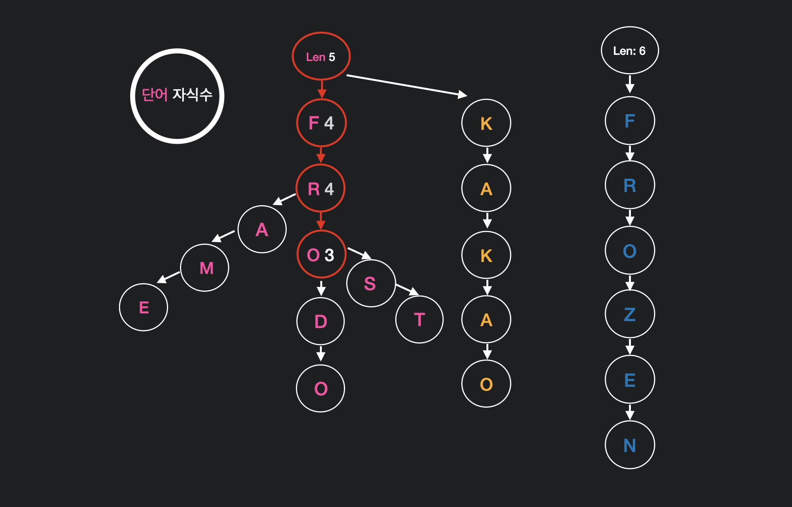
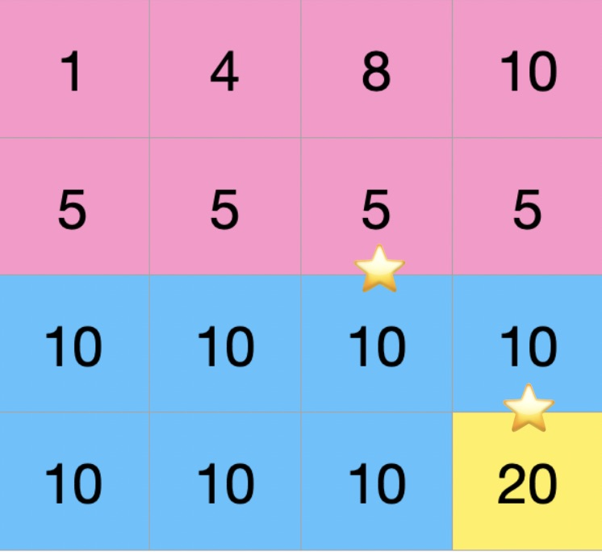
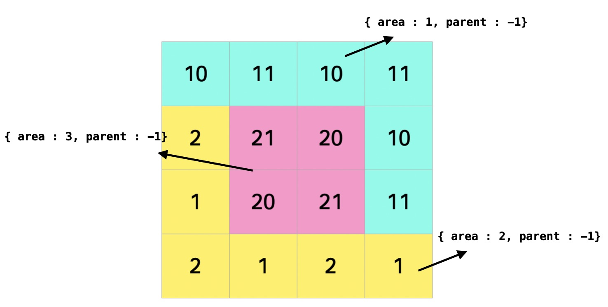
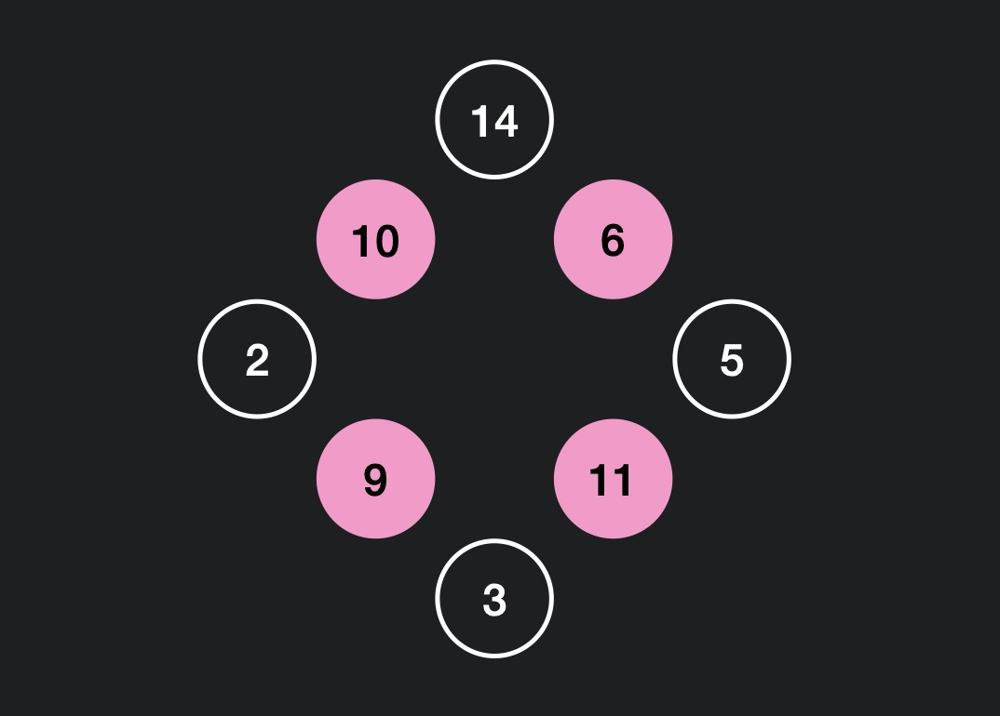
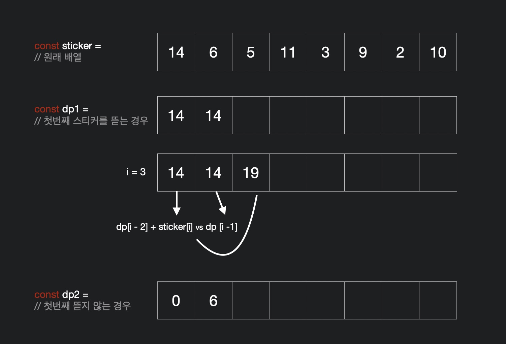

# 프로그래머스 Level04

## 가사검색 👉 Trie

[문제 링크](https://programmers.co.kr/learn/courses/30/lessons/60060) [나의 풀이](https://github.com/DKU-STUDY/Algorithm/blob/master/programmers/%EB%82%9C%EC%9D%B4%EB%8F%84%EB%B3%84/level04.%EA%B0%80%EC%82%AC_%EA%B2%80%EC%83%89/JeongShin.js)

### 1. 문제정의

아래와 같은 word 배열 내에서 queries 조건에 일치하는 문자의 개수를 구하여 배열로 반환하는 문제

    words = [ frodo, front, frost, frozen, frame, kakao ]
    queries = [ fro??, ????o, fr???, fro???, pro? ]

    이때,
    query 👉 일치하는 문자를 예로들면
    fro?? 👉 frodo, front, frost
    ????o 👉 frodo, kakao
    fr??? 👉 frodo, front, frost, frame
    fro??? 👉 frozen
    pro? 👉

와 같이 구할 수 있고 이에따라 [3, 2, 4, 1, 0] 을 반환해야 한다.

### 2. 풀이 & 코드

#### Approach 1. Linear Search

가장 처음 접근한 솔루션은 Regular Expression 을 이용한 선형 탐색구조이다.

이 접근 방법의 효율성을 따져보자.

예를들어 n 개의 문자열 집합 중에서 특정 문자열의 포함 여부를 알아내는데 linear search를 하게 되면 특정 문자열의 길이가 m이라 하면,

> Linear Search : O ( n\*m )

정렬을 한뒤 binary seach 를 하게 되면,

> Sorting & Binary Seach : O ( n\*m\*log n )

의 시간이 든다.

이때 문자열을 효율적으로 검색하는 `Trie` 자료구조를 사용하면

> Trie : O ( m\*log n )

의 가장 효율적인 방법이 된다.

#### Approach 2. Trie

예를들어 아래와 같은 단어들이 있다고 가정하자

    words = [ coat, coffee, cat, car, chrome ]

이를 트라이로 만들면 아래와 같이 된다.


따라서 가령 'co' 를 검색한다 하면 **root 👉 c 👉 o 노드로 이동**하여 결과로 'coffee' 와 'coat' 를 찾아낼 수 있다.

이제 문제로 돌아가보자. 가장 먼저 노드는 아래와 같은 클래스로 정의해주었다.

```JS
class TrieNode {
    constructor (key) {
        this.key = key;
        this.count = 0; // ⭐️ 자식 노드의 수
        this.children = {};
    }
}
```

이때 count 는 자식의 수를 나타낸다. count 변수는 기본적인 Trie 구조에 직접 추가해준 변수인데,

    fro?? 👉 frodo, front, frost

우리의 목적은 fro?? 라는 문자열로 해당 3개의 문자를 찾아내야한다. 따라서 **문자열의 길이를 이용**하면 조금 더 빠르게 검색할 수 있다.

아래와 같이 문자열의 길이 length에 따라 서로 다른 trie를 만들어 준 뒤,



기량 fro?? 의 경우 길이(len)는 5 가 되고 fro 까지 탐색을 한뒤 해당 노드의 count 를 반환해주면 된다. 위의 그림 1의 자식 수는 생략.

자 그럼 Trie 를 구현해보자. 필요한 함수는 트라이를 만드는 insert 함수, 문자열을 찾는 find 함수이다.

```JS
this.insert = function (word, target, idx, node = this.root) {
    while (idx !== target) {
        const curr = word[idx];
        if (!node.children[curr]) {
            node.children[curr] = new TrieNode(curr);
        }
        node.count++;
        node = node.children[curr];
        this.type ? idx++ : idx--;
    }
};
```

이 문제에 올 수 있는 queries 의 형태는 아래와 같다.

    1. fro?? 👉 ? 가 뒤에 오는 경우
    2. ????o 👉 ? 가 앞에 오는 경우
    3. ?????? 👉 ?만 오는 경우

2번 같은 경우 위와 같은 트라이 구조에서 검색이 불가능하다. 항상 search 는 문자열 앞에서 부터 또는 root 부터 하기 때문에 뒤에서 부터 **거꾸로 검색**하는 트라이가 필요하다.

따라서 length 별로, forward 트라이 (type : true), backward 트라이 (type : false) 세 가지 조건을 고려하여 구현 하였다.

이때 backward 트라이에 문자열을 insert 할때, 길이 n의 문자열을 뒤집는데 필요한 시간 복잡도는 O ( n ) 이 된다. 이 문제에서 주어지는 문자열은 상당히 길기 때문에 이 시간 또한 줄여주기 위해
split(), reverse(), join() 등의 함수를 이용하기보다 index와 length 를 이용하여 구현하였다.

```JS
this.find = function (word, len = word.length) {
    let node = this.root;
    let idx = 0;
    while (idx < len) {
        const curr = word[idx];
        if (!node.children[curr]) {
            return 0;
        }
        node = node.children[curr];
        idx++;
    }
    return node.count;
}
```

find 함수의 경우 ? 를 제외한 문자열을 검색한 뒤 해당 노드의 count 를 반환하여 구현하였다.

### 3. 어려웠던 점

트라이라는 자료구조를 몰랐기 때문에 기본적인 트라이를 구현하고 문제를 풀이하는 순서로 진행하여 꽤 오랜시간이 걸렸다.

하지만 문자열 관련된 문제는 나중에 언젠간 쓰일듯 하기 때문에 끝까지 풀이하여 성공,, 모든 테스트 케이스를 통과할땐, 짜릿하다 😖

이런 문제가 코딩 테스트에 나오면 풀이할 자신은 없지만 언제나 **어떻게든 한번 풀어보는게 중요**한거 같다 (스터디 준일이형이 해준 말).

## 지형 이동 👉 BFS, Union-Find

[문제 링크](https://programmers.co.kr/learn/courses/30/lessons/62050) [나의 풀이](https://github.com/DKU-STUDY/Algorithm/blob/master/programmers/%EB%82%9C%EC%9D%B4%EB%8F%84%EB%B3%84/level04.%EC%A7%80%ED%98%95_%EC%9D%B4%EB%8F%99/JeongShin.js)

### 1. 문제 정의

다음과 같이 2차원 배열 형태로 지형의 높이에 대한 정보 land와 높이를 넘을 수 있는 최대 크기 height 가 주어질 때

    land = [[1, 4, 8, 10], [5, 5, 5, 5], [10, 10, 10, 10], [10, 10, 10, 20]]
    height = 3

지형의 높이 차이가 3을 넘는 지형은 사다리를 놓아 이동한다고 가정할 때 모든 지형을 이동할 수 있도록 사다리를 배치한다. 이때 높이 차이가
사다리를 놓는데 드는 비용이라 가정할 때 비용을 최소화 하는 문제.

<center></center>

위와 같이 land 정보를 이용하여 3 구역으로 나눌 수 있고 이 구역을 넘기 위해서는 ⭐️ 위치에 사다리를 놓음으로써 최소 비용으로 모든 지형을 오갈수 있게 된다.

따라서 높이 차이 5와 10을 더한 15를 구하는 문제.

### 2. 풀이 & 코드

1. `BFS 탐색`으로 방문 가능한 구역을 방문하고 해당 구역의 구역번호 (area) 와 부모 (parent)를 초기값 (-1) 로 설정한다. 이때 방문이 불가능한 곳은 (사다리를 놓아야할 곳) edges 배열에 푸쉬 해둔다.



위와 같이 3개의 구역으로 나누어 진다. 이때 **부모 값 -1 은 자기 자신**을 가리킨다. 즉, 현재는 모든 구역의 부모는 자기 자신이 된다. 따라서 모두 서로 다른 집합 이라 볼 수 있다(서로 오갈수 없다).

2. Edges 를 `sorting` 한다. 그리디 기법으로 사다리 놓는 설치 비용을 최소화 하기 위해 높이차를 오름차순으로 정렬한다.


3. `Find` 위의 그림과 같이 모든 edges 를 표시하진 않았지만 설치 가능한 edges 가 ⭐️ 와 같은 위치에 있다고 가정하면, 이 중에서 **서로 다른 부모를 가진 edge**을 찾는다.

Edge 가 선택되면 { from, to } 좌표가 속한 집합에 따라 서로 다른 두 집합을 union 해주고 현재 edge 의 가중치를 결과 값(answer 변수)에 더해준다. Union 과정은 아래와 같다.


4. `Union` 둘 중 하나의 집합을 기준으로 부모를 재 설정하여 집합을 합쳐준다.

위와 같이 area 3은 부모를 area 1 로 가지고 area 1은 부모가 자기 자신이기 때문에 두 area 는 하나의 집합이 되었다.

3~4 의 union - find 과정을 모든 edges 별로 수행하면 모든 지형을 방문할 수 있게 된다.

### 3. 어려웠던 점

BFS 와 Union Find 두 가지 알고리즘을 둘다 이용해야하고 여러가지 고려해야할 조건들이 있어 까다로운 문제 였다. 다소 문제가 장황하게 느껴졌는데 이때 느낀게 문제를 **divide & conquer 전략으로 접근**하여

1. BFS 로 탐색하여 이동 가능한 구역을 그룹화 (자료구조화)

2. 모든 그룹을 Union

의 과정으로 나누어 풀이하려 하니 성공했다.

일단 그룹으로 나누어지는 문제의 경우 union find 를 잘 사용하도록 연습해봐야 겠다. 확실히 프로그래머스 기준 level 4 부터 union find 의 문제가 다수 나오는거 같다.

위의 풀이로 모든 테스트 케이스를 통과하긴 했지만 가까스로 통과했기 때문에 가장 효율적인 풀이는 아님에 분명하다 😥. 이후에 복습하면서 고쳐야 할 점이나 다른 풀이를 고려해봐야겠다.

## 호텔 방 배정 👉 Union-Find

[문제링크](https://programmers.co.kr/learn/courses/30/lessons/64063) [나의풀이](https://github.com/DKU-STUDY/Algorithm/blob/master/programmers/%EB%82%9C%EC%9D%B4%EB%8F%84%EB%B3%84/level04.%ED%98%B8%ED%85%94_%EB%B0%A9_%EB%B0%B0%EC%A0%95/JeongShin.js)

### 1. 문제정의

호텔에서 투숙객에게 방을 배정하는데 아래와 같은 룰에 따라 방을 배정한다.

     1. 한번에 한명씩 신청한 순서대로 방을 배정
     2. 고객은 원하는 방을 요청
     3. 고객이 원하는 방이 비어 있다면 즉시 방을 배정
     4. 고객이 원하는 방이 이미 배정 되어 있으면, 원하는 방보다 번호가 크면서
     비어 있는 방 중 번호가 가장 작은 방을 배정

만약 요청한 방이 다음과 같으면

    room_number = [ 1, 3, 4, 1, 3, 1 ]
    1 👉 1번 방 즉시 배정
    3 👉 3번 방 즉시 배정
    4 👉 4번 방 즉시 배정
    1 👉 1번 방은 이미 배정됨. 2번 방 배정
    3 👉 3, 4번 방은 이미 배정됨. 5번 방 배정
    1 👉 1,2,3,4,5번 방은 이미 배정됨. 6번 방 배정

즉, [ 1, 3, 4, 2, 5, 6 ] 을 리턴해야 한다.

### 2. 풀이 & 코드

이 문제는 정확성과 효율성을 요구하는 문제이다.

따라서 단순히 생각하면 모든 방마다 비어 있는 방을 linear search 하면 되지만 효율성을 고려하면 적합하지 않다.

`Union-find` 는 두개의 set 의 합집합을 찾을때 쓰이는 자료구조 이다.

이 문제에서 union-find 가 동작하는 원리를 이용하여 풀이를 구현할 수 있는데 다음과 같다.

    만약 { 현재방 => 다음 배정 가능한 방 } 이라 가정할 때,
    1번 방이 배정되면 { 1 => 2 } 가 된다.
    2번 방이 배정되면 { 2 => 3 } 이 된다.
    이때 만약 다시 1번 방 혹은 2번 방에 대한 요청이 들어올때
    { 1 => 3 , 2 => 3 } 과 같은 정보가 있다면 방을 즉시 배정 가능하다.
    이때 1, 2번 방은 같은 부모(3번 방)를 가지는 하나의 집합이라 볼수 있다.

따라서 union-find 의 기법을 이용하여 요청이 들어온 방 별로 부모(배정 가능한 방)를 찾고
Map이란 자료구조에 해당 집합을 계속해서 업데이트 해주어 문제를 해결해보자.

```JS
const room = new Map(); // ES6 Map 자료구조를 이용한다.
const findAndUnion = (n) => {
    /* 1. Find */
    if (!room.has(n)) { // 부모를 찾지 못하면
        room.set(n, n + 1); // 부모를 n + 1 로 설정해준다.
        return n; // 배정 가능한 방을 찾았으므로 리턴 해준다.
    }
    /* 2. Union */
    let parent = findAndUnion(room.get(n)); // 재귀적 호출로 최상위 부모를 찾아낸다.
    room.set(n, parent + 1) // 현재 방의 부모를 최상위 부모 + 1로 설정한다.
    return parent; // 최상위 부모 (이용 가능한 가장 작은 번호의 방)을 리턴한다.
}
```

자 이제 동작 원리를 위의 예제를 통해 알아보자.

    1 👉 Map에 1은 없음 parent는 1
        Map { 1 => 2 }
    3 👉 Map에 3은 없음 parent는 3
        Map { 1 => 2, 3 => 4 }
    4 👉 Map에 4은 없음 parent는 4
        Map { 1 => 2, 3 => 4 , 4 => 5 }
    1 👉 Map에 1이 존재 parent는 2
        Map { 1 => 3, 2 => 3, 3 => 4, 4 => 5 }
        이때 1 => 2 에서 1 => 3 으로 parent를 바꿔준다.
    3 👉 Map에 3이 존재 3 => 4, 4도 존재 4 => 5 parent는 5
        Map { 1 => 3, 2 => 3, 3 => 6, 4 => 6, 5 => 6 }
        마찬가지로 3, 4, 5 거쳐온 경로 내에서 모든 부모를 최상위 부모 (5) + 1 인 6으로 바꿔준다.

즉, 가장 중요한 점은 비어있는 방을 탐색하면서 (Map에 없는 값을 탐색) 지나온 모든 경로에 해당되는 방의 부모를 최상위 부모 + 1 로 설정해주는게 중요하다.

### 3. 어려웠던 점

지나온 모든 경로에 대한 부모를 모두 같은 최상위 부모 + 1 로 설정해주는데 어려움을 겪었다.

재귀호출은 언제나 코드를 보면 이해는 가지만 직접 구현하기 어렵다 ㅠ ㅠ 🤯

## 징검다리 👉 Binary Search

[문제링크](https://programmers.co.kr/learn/courses/30/lessons/43236) [나의풀이](https://github.com/DKU-STUDY/Algorithm/blob/master/programmers/%EB%82%9C%EC%9D%B4%EB%8F%84%EB%B3%84/level04.%EC%A7%95%EA%B2%80%EB%8B%A4%EB%A6%AC/JeongShin.js)

### 1. 문제정의

rocks 라는 바위의 위치를 나타내는 배열, distance 최대 거리, n 제거할 바위 수 세 개의 조건을 고려한다.

    바위는 0 부터 distance 사이에 rocks 배열에 나타난 위치에 바위가 놓여져 있다.
    예를들어, rocks = [2, 11, 14, 17, 21], distance 는 25, n 은 2 라고 할때
    두 개의 바위를 정하여 제거 해야한다. 이때 2, 14 가 제거되면 바위들의 위치는
    [11, 17, 21]이 되고 사이 거리는 [11, 6, 4, 4]가 된다. 이때 거리의 최소 값 4를 구할 수 있다.

이때 n개의 바위를 제거하여 각 바위들 사이 거리가 최소가 되도록하여 최소 거리를 구하는 문제.

### 2. 풀이 & 코드

바위 사이에 거리는 1 ~ distance 사이 범위내에 존재한다. 즉, 바위 간격이 아무리 멀어도 distance 보단 작고, 아무리 가까워도 1보단 크다.

즉 우리가 구하려는 최소 거리 또한 1 ~ distance 사이 내에 존재한다. 이를 기반으로 이분탐색을 구현해보자.

```JS
const binSearch = () => {
    let [left, right] = [1, distance];
    while (left <= right) {
        mid = ~~ ((left + right) / 2);
        // some codes
        if (/* some condition */){
            left = mid + 1;
        }
        else
            right = mid - 1;
    }
}
```

일단 기본적인 이분탐색 뼈대에서 mid 값은 우리가 구하려는 최소 거리가 된다.

따라서 some condition 에 오는 값은 **최소 거리 mid 값이 n개의 바위 내에서 구해질 수 있는가**가 되야 한다. 말이 어렵다. 아래 예제를 보자.

    Example 💁🏻‍♂️
    | 0 | 2 | 11 | 14 | 17 | 21 | 25 | 에서
    mid = 5, n = 2, removed = 0 (제거한 바위 수) 라고 가정하자.

    0 👉 2 사이의 거리는 5보다 작기 때문에 제거. removed = 1
    0 👉 11 사이의 거리 (2는 제거 되었기 때문에 고려 X) 는 5보다 크기 때문에 통과. removed = 1
    11 👉 14 사이의 거리는 5보다 작기 때문에 제거. removed = 2
    11 👉 17 사이의 거리는 (14는 제거 되었기 때문에 고려 X) 5보다 크기 때문에 통과.
    17 👉 21 사이 거리는 5보다 작기 때문에 제거. removed = 3
    이때 removed > n 이 되기 때문에 해가 될 수 없음.

    따라서 5 보다 더 작은 mid 값으로 이분탐색 진행

즉, some codes 에서 현재 mid 값으로 n개 이내의 범위 내에서 제거하여 해를 구할 수 있는가를 따져서 구현해주면 된다.

```JS
const isPossible = (min) => {
    let [removed, prev] = [0, 0];
    for (const curr of rocks) {
    // 1) 현재 바위와 이전 바위 사이 거리를 구함
        const currDistance = curr - prev;

    // 2) 거리가 최소 거리보다 짧을 경우 제거 대상이 됨
        removed += currDistance < min;

    // 3) 현재 바위가 제거 될 경우 현재 기준 prev를 그대로 전달
        prev = currDistance < min ? prev : curr;

    // 4) 제거한 바위 수가 n을 넘어가면 실패
        if (removed > n)
            return false;
    }
    return true;
};
```

prev 바위를 설정하는게 다소 까다로운데

1. 현재 바위 (curr) 가 제거 될 경우 현재 바위의 prev 가 그대로 다음 바위로 전달되어야 함
2. 현재 바위가 제거되지 않을 경우 prev 가 현재 바위로 설정 되어야 함

이 두 가지 경우를 잘 고려해주면 별 어려움 없이 해를 구할 수 있다.

### 3. 어려웠던 점

이 문제는 이분탐색이라는 문제 카테고리를 알고 있었지만 한번에 풀이에 접근하지 못했다.

계속 linear search 를 해가면서 최소 거리 바위를 구하고 삭제하고 다음 최소 거리 바위를 구하고의 방법으로 접근하였다. 시간복잡도도 N \* 제거할 바위 수 가 될 뿐더러 정확도에서도 제대로 된 결과를 얻지 못했다.

## 스티커 모으기 👉 DP

[문제 링크](https://programmers.co.kr/learn/courses/30/lessons/12971) [나의 풀이](https://github.com/DKU-STUDY/Algorithm/blob/master/programmers/%EB%82%9C%EC%9D%B4%EB%8F%84%EB%B3%84/level04.%EC%8A%A4%ED%8B%B0%EC%BB%A4_%EB%AA%A8%EC%9C%BC%EA%B8%B0/JeongShin.js)

### 1. 문제정의

다음과 같이 스티커가 있다고 할때,

    sticker = [ 14, 6, 5, 11, 3, 9, 2, 10 ]

스티커가 원형 구조로 되어 있다. 이때 스티커를 하나씩 뜯어내는데 스티커를 뜯어낸 양 옆에 스티커는 뗄 수 없게 된다. 뜯어낸 스티커 값의 합이 최대가 되도록 뜯어 최대 값을 구하는 문제.

<center></center>

다음과 같이 6, 11, 9, 10 의 스티커를 떼어내면 최대 값 36을 구할 수 있다.

### 2. 풀이 & 코드

처음 시도는 Branch & Bound 접근 방법을 시도 하였다.


위의 그림과 같이 ( 가중치, T 👉 현재 스티커를 뗄 수 있음 또는 F👉 현재 스티커를 뗄 수 없음 ) 노드를 branch를 생성해 나가면 되는데 깊이가 깊어 질 수록 **노드의 숫자는 2 ^ N** 에 가깝게 늘어 간다.

따라서 적절하게 bound 해줘야 하는데 이때, 첫번째 스티커 선택 여부에 따라 마지막 선택이 영향을 받게 되기 때문에 가중치를 기준으로 bound 해줄 수 없게 된다. 즉, 마지막 요소까지 정하기 전에 bound 를 하게 되면 해가 되는 노드를 제거하는 불상사가 발생 할 수 있다. 따라서 비효율적인 풀이법이 된다.

즉, DP 로 풀이하는 방법을 이용해야 한다.

```JS
const dp1, dp2;
dp1 = [/* 초기 값*/] // 첫 스티커를 뜯는 경우
dp2 = [/* 초기 값*/] // 첫 스티커를 뜯지 않는 경우
```

위와 같이 두가지 경우로 나누어



와 같이 설정해준다. 3번째 인덱스부터 아래와 같은 반복문을 수행해 준다.

```JS
// 현재 최대 값 = 현재 스티커를 떼는 경우 vs 떼지 않는 경우
//           = 2칸전 최대 값 + 현재 스티커 가중치 vs 1칸전 최대 값
for (i = 2; i < len - 1; i++) {
    dp1[i] = Math.max(dp1[i - 2] + sticker[i], dp1[i - 1]);
    dp2[i] = Math.max(dp2[i - 2] + sticker[i], dp2[i - 1]);
}
// 마지막 인덱스의 경우 dp1 에 한하여 현재 스티커를 뗄 수 없음을 고려 해준다 !
dp1[lastindex] = Math.max(dp1[lastindex - 1], dp1[lastindex - 2]);
```

len-1 까지만 수행해주는 이유는 마지막 스티커의 경우 따로 처리를 해줘야 한다.

예를들어 sticker = [14, 6 , 5] 의 경우 dp1 = [14, 14, 19] 가 되지만 실제로 14와 5를 동시에 뗄 수 없다 (위의 그림 참고).

### 3. 어려웠던 점

그냥 어려웠다. 알고리즘 문제가 내가 모르는 자료구조를 이용하거나 처음 접해보는 문제 유형의 경우 어쩔수 없이 풀이를 보지만, 알듯 말듯한 이런 문제가 더 시간이 오래 걸리고 어렵게 느껴진다 ㅠㅠ.

이 문제를 풀고 느낀점은 dp 풀이 할때 **어떤 선택이 어떤 값에 영향**을 주는지 따라서 어떻게 코딩을 해야 정확한 답을 구해낼지를 잘 고려 해야겠다.

이 문제의 경우 **첫번째 선택이 마지막 선택에 영향**을 주기 때문에 이 경우를 잘 고려하는게 중요하였다.

## 무지의 먹방 라이브 👉 Array

[문제 링크](https://programmers.co.kr/learn/courses/30/lessons/42891) [나의 풀이](https://github.com/DKU-STUDY/Algorithm/blob/master/programmers/%EB%82%9C%EC%9D%B4%EB%8F%84%EB%B3%84/level04.%EB%AC%B4%EC%A7%80%EC%9D%98_%EB%A8%B9%EB%B0%A9_%EB%9D%BC%EC%9D%B4%EB%B8%8C/JeongShin.js)

### 1. 문제정의

무지가 먹방을 하는데 걸리는 시간의 배열이 있을때, k초 시간만큼 네트워크 장애가 발생 했다.

    food_times = [ 3, 1, 2 ], k= 5

이때 방송이 재개 했을때 먹을 음식의 인덱스를 반환 하는 문제. 예제의 경우 1 을 반환하면 된다.

### 2. 풀이 & 코드

이 문제는 k를 하나씩 줄여나가면서 배열을 계속해서 순회하면 쉽게 풀 수 있다. 하지만 효율성을 고려하면 k 값은 1 이상 2 x 10^13 의 숫자인데 최악의 경우 배열에 2 x 10 ^13 번의 접근이 필요하다.

따라서 아래의 방법으로 단 1번의 순회 O (n) 으로 풀이 할 수 있다 (이후에 다루겠지만 정렬 시간을 더해주면 이보다는 큰 시간 복잡도가 된다).

예제와 함께 슈도 코드를 작성 해보았다.

```JS
const food_times = [3, 5, 1, 6, 5, 4], k = 22;
func sol:
    foods = [];
    // 1. {time, index}를 저장하는 배열을 새로 만든다.
    foreach food_times push {time, index} to foods;
    // 2. 시간에 따라 오름차순으로 정렬한다.
    sort foods by time
```

이제 배열을 순회하면서 현재 인덱스 기준으로 같은 시간대에 음식들을 한꺼번에 빼준다. 말이 어렵다면 아래 그림을 보자.


현재 인덱스의 time 값은 최소 값 min 이 된다. 이후에 오는 모든 time 들은 min 값보다 큰게 보장 되기 때문 (정렬되어 있기 때문)에 CHUNK 를 한꺼번에 계산하여 빼준다. 이때 k 값에서 chunk 를 계속해서 빼주며 0보다 작아지는지 확인 해준다.

    CHUNK = length - height
    = (total_length - curr_index) - (curr_min - prev_min)

이를 반복하다가 k 가 만약 0보다 작아질 경우, 우리가 찾고자 하는 해를 구해낼 수 있다. 이때 주의 할 점은 남은 배열의 값들을 다시 **index 순으로 정렬** 해야한다.

문제로 돌아가보면 무지는 음식이 오는 순서대로 (index 순서로) 먹는다. 따라서 우리는 편의상 time 순으로 정렬 했지만 이제 해에 근접 해있기 때문에 해당 index를 구해야 하기 때문에 다시 문제의 조건대로 정렬 해준다.


위의 그림과 같이 index 순서대로 다시 정렬 해준뒤 남은 k 값 만큼의 k 번째 값의 인덱스를 구해주면 해를 구할 수 있다. 이 예제의 경우 5 가 된다. 만약 전체 배열을 순회했는데 k 값이 0보다 클 경우 -1을 반환해주어 처리해준다.

따라서 위의 방법으로 2번의 정렬과 한번의 순회로 풀이 할 수 있다. 시간복잡도는 O (n log n)이 된다.

### 3. 어려웠던 점

특정 자료구조가 아닌 논리적인 사고로 효율성을 증가 시키는 문제인데 상당히 어렵게 느껴졌다. 이런 문제를 자주 풀고 복습을 반복하여 이러한 문제푸는 사고를 높혀야 겠다.
