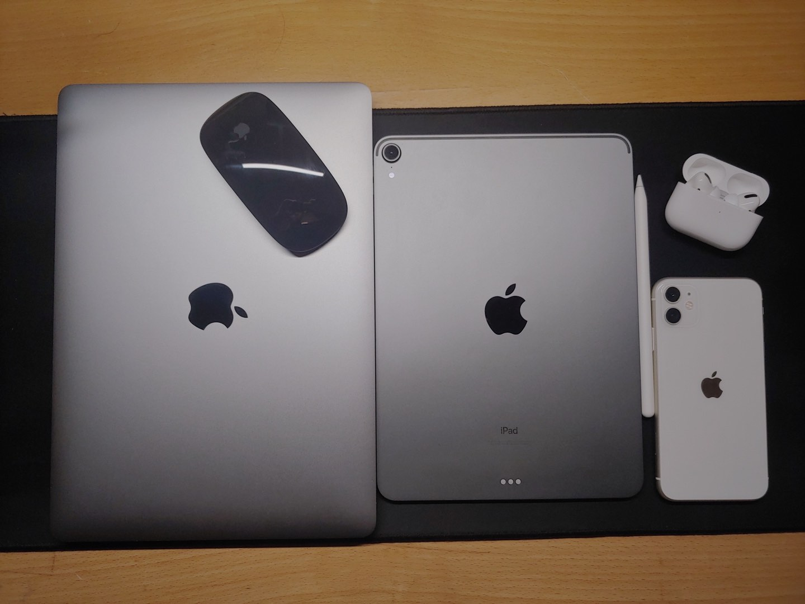
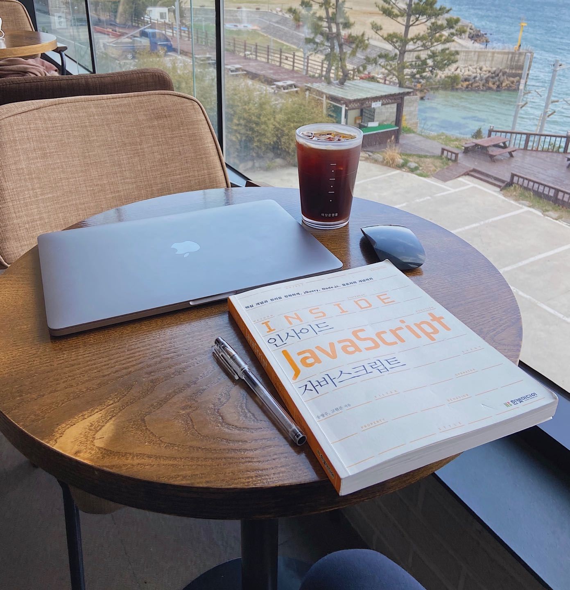
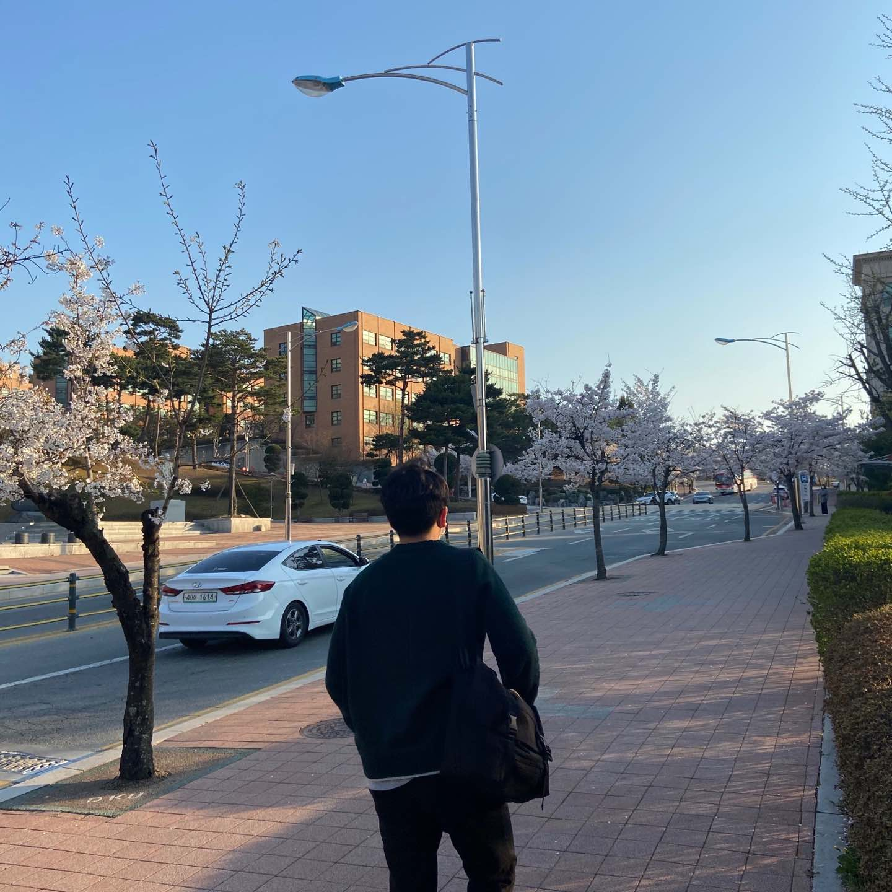

<h1> 저의 블로그를 소개합니다 😇 </h1>

    

        

            

                
            

            

                <h2>Today I Learned 🙇🏻‍♂️</h2>
                <h4>오늘 공부한 내용을 정리 & 요약 합니다</h4>
            

        

        

            

                
            

            

                <h2>Algorithms 💻</h2>
                <h4>풀었던 알고리즘 문제들 중 어려웠거나 유용한 문제들을 정리 합니다</h4>
            

        

        

            

                
            

            

                <h2>Book-Review 📚</h2>
                <h4>한달에 최소 1권씩 책을 읽고 책을 리뷰 합니다</h4>
            

        

        

            

                
            

            

                <h2>Daily 🌄</h2>
                <h4>매달 공부한 내용을 되돌아 보고 저의 일상을 리뷰 합니다</h4>
            

        

    

